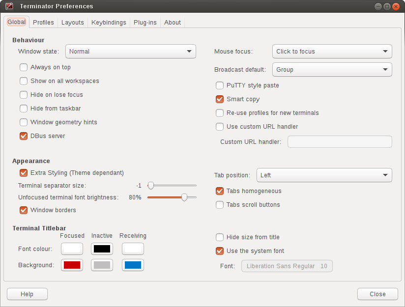
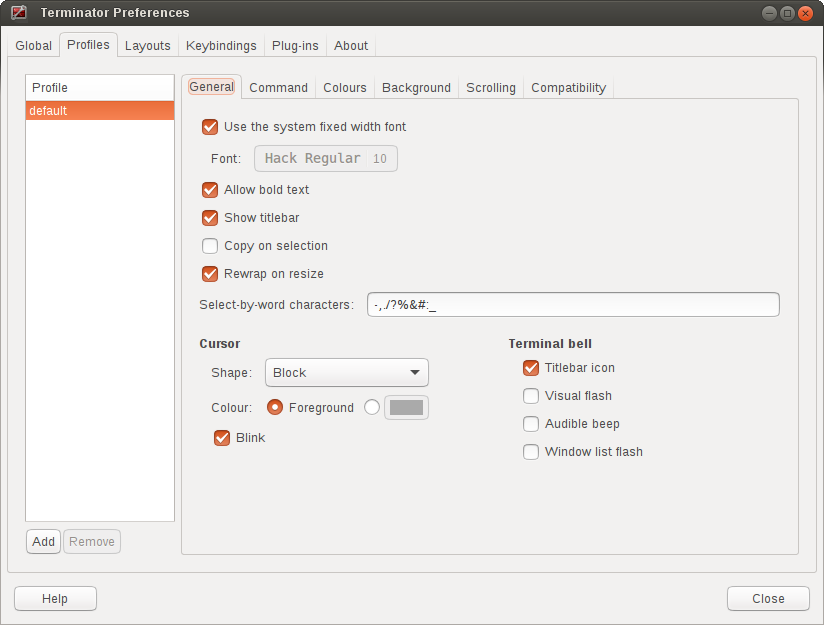
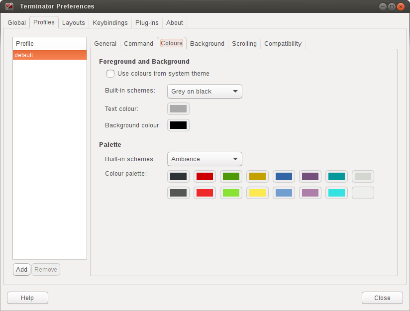
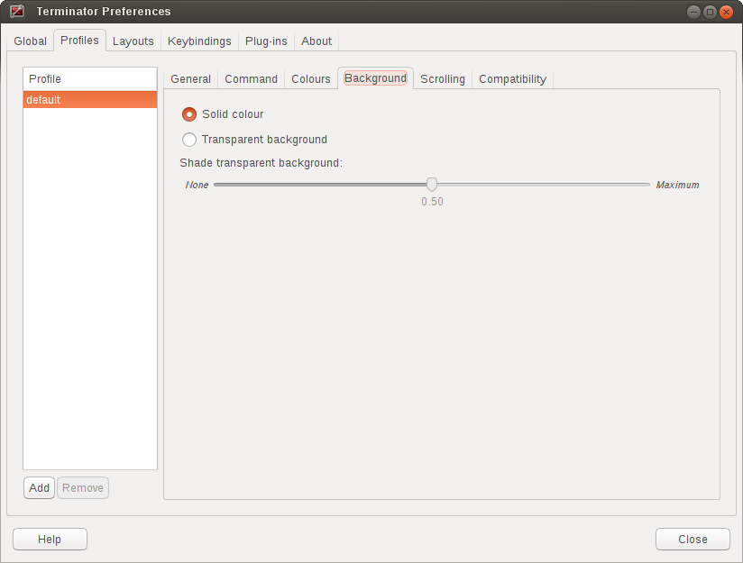
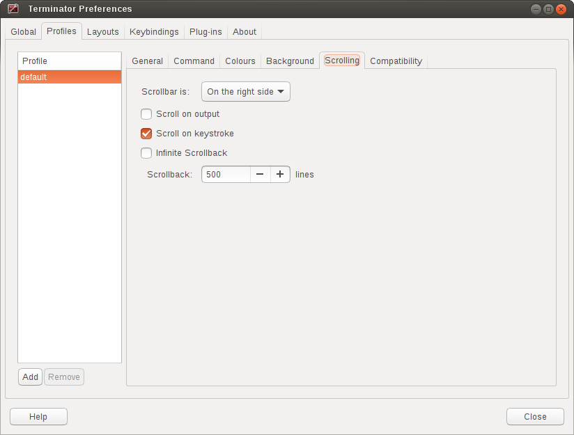
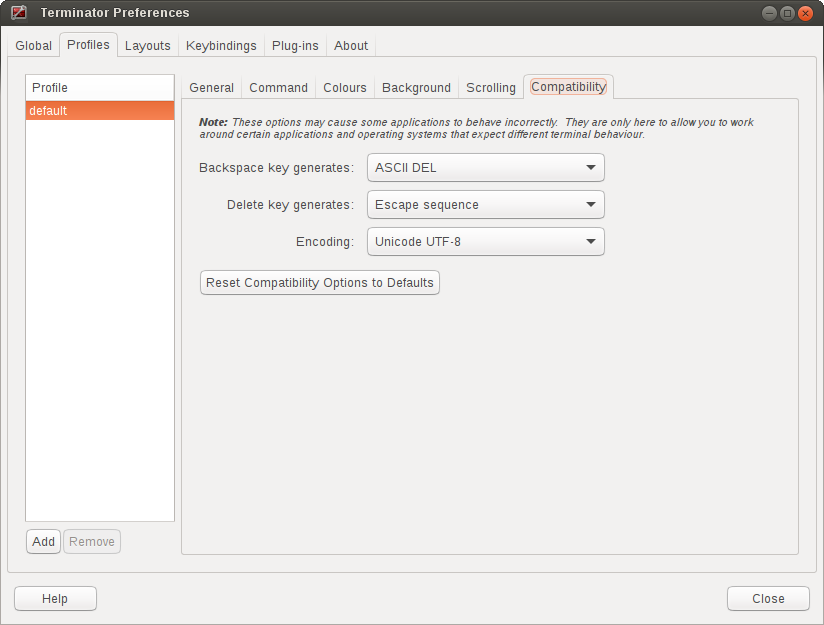
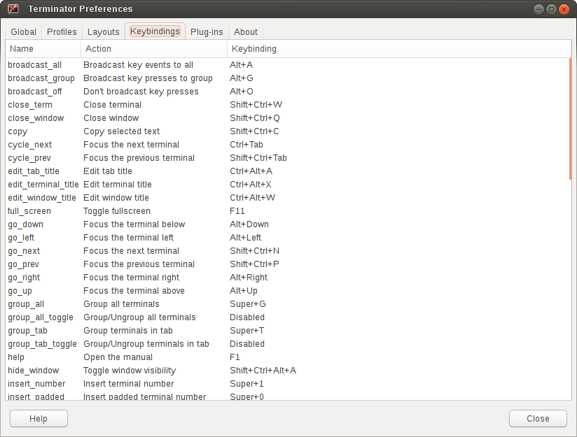
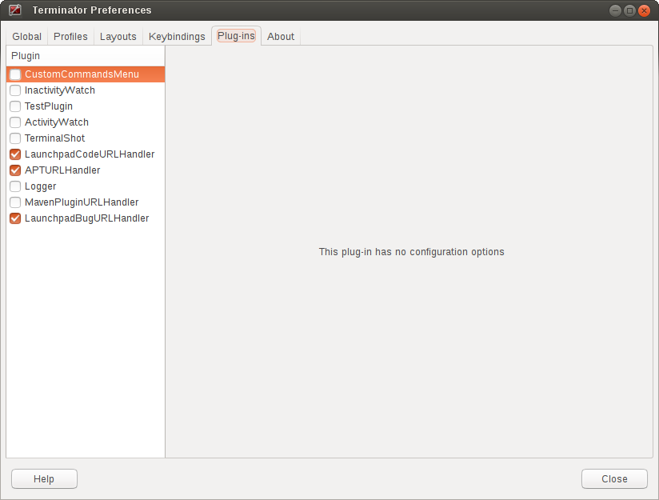
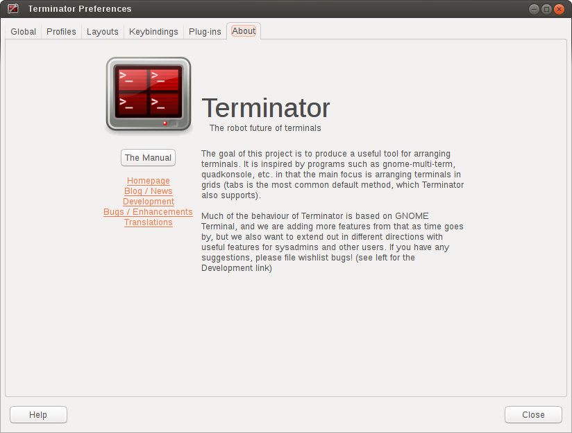

.. image:: imgs/icon_prefs.png
   :align: right
   :alt: Because spanners mean settings?!?!?

.. _preferences:

==================
Preferences Window
==================

Terminator is *highly* configurable, and automate-able, so the Preferences
dialog is naturally quite extensive. It currently consists of six tabs.
Let's work through them one by one.

.. _prefs-global:

------
Global
------

These settings are defaults, but some of them can be overridden by a
options on the command-line, or within a layout. A number will also
require a restart to take effect.

^^^^^^^^^
Behaviour
^^^^^^^^^

  **Window state** (default: Normal)

    This will determine what happens on startup normally.

    - *Normal* - Window opens as normal.
    - *Hidden* - Window does not open. Useful at login, so it is already 
      available with a shortcut.
    - *Maximised* - Window opens maximised in the standard window manager
      frame.
    - *Fullscreen* - Window opens fullscreen with no window manager frame.

  **Always on top** (default: off)

    New windows attempt to remain on top, until deactivated in the window
    menu.

  **Show on all workspaces** (default: off)

    New windows will follow if you switch to a different virtual desktop,
    until deactivated in the window menu.

  **Hide on lose focus** (default: off)

    This is a quake console like feature, where the user want the window to
    vanish when clicking elsewhere.

    .. warning:: This is rather buggy at the moment as it is very easy for
                 the main window to lose focus and disappear.

  **Hide from taskbar** (default: off)

    The first window opened will not be displayed in the taskbar.
    Subsequent windows will show in the taskbar (bug?).

  **Window geometry hints** (default: off)

    If this is checked, then when resizing Terminator will attempt to
    step the sizing by the current font, and display a small box with the
    dimension of the window in characters. 
  
    .. warning:: If you have problems with Terminator windows shrinking
                 in an uncontrollable way, then turning this option
                 **off** will usually fix the issue. It is not clear
                 why, but it seems Terminator and the window manager
                 get into an argument over what size the window should
                 be. Frankly this feature causes more trouble than it's
                 worth. Don't be surprised if it gets removed at some
                 point.

  **DBus server** (default: on)

    If a Terminator :ref:`dbus` server is not already on the session
    bus, try to start one.

  **Mouse focus** (default: Click to focus)

    By what method the mouse pointer sets the focus on a terminal.

    - *GNOME Default* - Act as per the system settings.
    - *Click to focus* - You must click with in a terminal to make it the
      focus.
    - *Follow mouse pointer* - Moving the pointer over a terminal makes
      it the focus.

  **Broadcast default** (default: Group)

    Which broadcast mode should be selected at startup:

    - *All* - All terminals receive keystrokes.
    - *Group* - Only terminals in the same group as the current terminal
      receive keystrokes.
    - *None* - Only the current terminal receives keystrokes.

  **PuTTY style paste** (default: off)

    Make the right mouse button operate like in PuTTY, so ``right-click``
    will paste the Primary selection, and ``middle-click`` will open
    the :ref:`Context Menu <context-menu>`. (For ex-PuTTY users).

  **Smart copy** (default: on)

    If enabled and there is no selection, the shortcut is allowed to
    pass through. This is useful for overloading ``Ctrl``\ +\ ``C``
    to either copy a selection, or send the SIGINT to the current process
    if there is no selection. If not enabled the shortcut does not pass
    through at all, and the SIGINT does not get sent.

    .. note:: For newbies SIGINT is the keyboard interrupt signal that
              will interrupt the program running in the foreground of a
              terminal.

  **Re-use profiles for new terminals** (default: off)

    When creating a new terminal with splitting or new tabs, if this is
    enabled, then the profile from the previously focussed terminal will
    also be used for the new one.

  **Use custom URL handler** (default: off)

    If this is enabled then ``Ctrl``\ +\ ``click`` on a URL will try to use
    the command defined in *Custom URL handler* to open the link. If not
    enabled, Terminator will attempt to open the link with its internal
    logic. In order this attempts to open the URL using GTK, xdg-open,
    and lastly pythons internal web browser support.

  **Custom URL handler** (default: inactive, empty)

    If active and set, then URL's will be passed as a command-line parameter
    to the given command.

^^^^^^^^^^
Appearance
^^^^^^^^^^

  **Extra Styling (Theme dependant)** (default: on)

    For themes we have the option to include some additional CSS code
    to make the window a bit prettier. For example under the Ubuntu
    Ambiance theme GNOME Terminal has custom tabs. In line with our
    unofficial policy of following gnome-terminal, I have replicated
    that customisation for Terminator. Some may prefer to use the
    unadulterated standard tabs, so using this option the extra styling
    can be turned off.

  **Terminator seperator size** (default: -1)

    This is the width in pixels, and can range from -1 to 20. The value
    of -1 will take the default size from the system theme.

    .. note:: Making this too small will make grabbing the splitters
              quite difficult, as we remove the oversized splitter
              handles some themes provide because it interferes with
              mouse selection of text.

  **Unfocused terminal font brightness** (default: 80%)

    Terminals that do not currently have the focus will can be dimmed
    to aid focus. The value can range from 0% (invisible) to 100% (full
    brightness)

  **Window borders** (default: on)

    The window manager frame is removed from your windows.

  **Tab position** (default: Top)

    Where the tabs will be located within the window

    - *Top*
    - *Bottom*
    - *Left*
    - *Right*
    - *Hidden* - Tabs still work, you just can't see them.

  
  **Tabs homogeneous** (default: on)

    .. warning:: This option was removed during the port to GTK 3,
                 and has no effect, apart from giving access to the
                 *Tab scroll buttons* option.

                 It used to give the choice between tabs of uniform
                 and non-uniform width.

  **Tabs scroll buttons** (default: off)

    When there are more tabs than can fit within the window buttons will
    be drawn for moving left and right.

    .. warning:: If the tab scroll buttons are turned off and you open
                 an extreme number of tabs in a single window, an
                 undesireable behaviour occurs. Once the tabs reduce to
                 the minimum possible size the window is forced wider to
                 accomodate additional tabs. It is not immediately
                 obvious as to what the correct response is in this
                 situation.

^^^^^^^^^^^^^^^^^
Terminal Titlebar
^^^^^^^^^^^^^^^^^

  There is a table of the colours for the titlebars on the left. These
  are modelled on those used in a utility I used to use called ClusTerm.
  The three sets (Focused, Inactive and Receiving) will make more sense
  after reading the section about :ref:`grouping-menu`.

  +-------------+---------+----------+-----------+
  |             | Focused | Inactive | Receiving |
  +=============+=========+==========+===========+
  | Font colour | #FFFFFF | #000000  | #FFFFFF   |
  +-------------+---------+----------+-----------+
  | Background  | #C80003 | #C0BEBF  | #0076C9   |
  +-------------+---------+----------+-----------+

  **Hide size from title** (default: off)

    At the end of the label in the titlebar the size of the terminal is
    given in characters, i.e. (80x24). Enabling this item will disable
    the size text.

  **Use the system font** (default: on)

    By default the system defined proportional font will be used for the
    text in the titlebar. Turning this off allows you to use a custom font.

  **Font** (default: inactive, system proportional font)

    If active and set, then the custom font to be used in the titlebar.

.. _prefs-profiles:

--------
Profiles
--------

You should already be familiar with the sub-tabs from GNOME Terminal,
and Terminator's are modelled on those available in GNOME Terminal where
it makes sense, and give much of the same functionality.

Below we will go through each pane, and highlight and explain differences
between Terminator and GNOME Terminal.

^^^^^^^
General
^^^^^^^

One key difference is that we have a sidebar to the left listing the
available Profiles, as opposed to GNOME Terminal, where the list is
a separate window launched from the menu bar. This also means a few of
the widgets, like the profile name, are not needed.

**Use the system fixed width font** (default: on)

  By default the system defined proportional font will be used for the 
  text in the terminal. Turning this off allows you to use a custom font.

**Font** (inactive, system fixed width font)

  If active and set, then the custom font to be used in the terminal.

**Allow bold text** (default: on)

  Allows you to disable the use of bold fonts in the terminal.

**Show titlebar** (default: on)

  The titlebar strip across the top of each terminal can be turned off.

**Copy on selection** (default: off)

  This puts the selection into the copy/paste buffer, as well as being
  available on middle-click.

**Rewrap on resize** (default: on)

  This will cause longer lines to rewrap when a terminals width changes.

  .. note:: Larger or infinite scrollback buffers may become slow when
            this option is enabled. 

**Select-by-word characters** (default: ``-,./?%&#:_``)

  Using ``double-click`` to select text will use this pattern to define
  what characters are considered part of the word.

""""""
Cursor
""""""

  **Shape** (default: Block)

    Set the cursor shape

    - *Block* - Solid rectangle.
    - *Underline* - Single pixel tall horizontal line.
    - *I-Beam* - Single pixel wide vertical line.

  **Colour** (default: Foreground)

    The colour of the cursor. A radio option of Foreground will use
    whatever the foreground is defined as for regular text, as set
    in the Colours tab. Alternatively a custom colour can be chosen
    using the colour swatch.

    .. note:: Foreground uses xor'ing so the text under the cursor is
              always clear. Xor'ing is not used with a custom colour.
              This means that if the colour of the character under the
              cursor is similar to the colour chosen, then it can be
              difficult to discern what that character is. The following
              option can help with this.

  **Blink** (default: on)

    Whether the cursor blinks on and off.

"""""""""""""
Terminal bell
"""""""""""""

  **Titlebar icon** (default: on)

    On the right side of the titlebar a small light-bulb icon will
    be displayed for a few seconds.

  **Visual flash** (default: off)

    The terminal area will briefly flash.

  **Audible beep** (default: off)

    The normal system beep noise as defined in system settings.

  **Window list flash** (default: off)

    This will set the urgent flag on the window in the taskbar. The
    actual effect will be taskbar dependant.

"""""""""""""""""
Not in Terminator
"""""""""""""""""

  **Profile name**

    Our profiles names are in the sidebar to the left.

  **Profile ID**

    Ummm... OK, I have no idea what GNOME Terminal uses this for.

  **Show menubar by default in new terminals**

    Terminator doesn't use a traditional menu bar. This has been removed
    in new versions of GNOME Terminal.

  **Terminal bell**

    Terminator has more options, so has four separate options in their
    own grouping. This item in GNOME Terminal is the same as *Audible
    beep* defined above.

  **Initial terminal size**

    Terminator handles window sizes within :ref:`Layouts <layouts>`,
    or with :ref:`command-line-options`.

^^^^^^^
Command
^^^^^^^

.. image:: imgs/prefs_profiles_command.png
   :scale: 100%
   :align: center

**Run commands as a login shell** (default: off)

  Force the command to run as a login shell.

**Run a custom command instead of my shell** (default: off)

  Enable the use of a custom command instead of the users default
  shell.

**Custom command** (default: inactive, empty)

  If enabled and set, the users default shell will be replaced with
  the command specified here.
  
  .. note:: If you place an entry here note that there is no ``bash`` or
            other shell underneath it. When the command ends, there
            is no chance to drop to a shell or other program. This can
            be worked around by using the shell line seperator ``;``
            and a following ``bash`` command.

  .. warning:: Running a non-bash program as a command *can* lead to
               unexpected results. Some programs behaviour depends on
               having a full, interactive shell underlying the program.
               An expample would be ``mutt``. Run standalone, at startup
               it will begin with all threads expanded. Using::

                 bash -c mutt

               will also not work, as this is a non-interactive session.
               Instead make the session interactive with::

                 bash -ic mutt

**When command exits** (default: Exit the terminal)

  When the running command exits (default or custom) what action
  should be taken.

  - *Exit the terminal* - Terminal closes, causing layout to adjust.
  - *Restart the command* - Original command restarts immediately.
  - *Hold the terminal open* - The terminal and scrollback will remain
    visible and accessible until the user explicitly closes the
    terminal, or closes the window.

  .. warning:: If you are using *Restart the command* and your command
               is broken and exits immediately, then you can end up
               in a resource hungry loop.

^^^^^^^
Colours
^^^^^^^

There seems to be some mild quirks and differences (palettes available
or selected from the system theme) between Terminator and GNOME
Terminal.

"""""""""""""""""""""""""""""""""""""""
Foreground and Background
"""""""""""""""""""""""""""""""""""""""

  **Use colours from system theme** (default: off)

    Use colours as defined in the system theme. These are requested
    from the underlying VTE widget.

  **Built-in schemes** (default: Grey on black)

    Pick a primary colour combination for foreground and background.
    Again there are differences between Terminator and GNOME Terminal.

    The list for GNOME Terminal seems to be dynamic and vary depending
    on the system, with the addition of *Custom* which allows setting
    the colours as desired. Terminator has a number of schemes hard
    coded. (This may see improvement at some point.)

  **Text colour** (default: inactive, #AAAAAA)

    If the *Built-in schemes* is set to *Custom* the text colour can
    be set here.

  **Background colour** (default: inactive, #000000)

    If the *Built-in schemes* is set to *Custom* the background colour
    can be set here.

"""""""""""""""""""""""""""""""""""""""
Palette
"""""""""""""""""""""""""""""""""""""""

  **Built-in schemes** (default: Ambience)

    A predefined colour palette can be selected. The same text applies
    as used for the *Built in schemes* option under *Foreground and
    Background* .

  **Colour palette** (default: inactive)

    If the Palette's *Built-in schemes* is set to custom, a set of
    colour swatches are used to configure the 16 primary colours
    of the shell palette.

"""""""""""""""""""""""""""""""""""""""
Not in Terminator
"""""""""""""""""""""""""""""""""""""""

  **Bold colour**

    In theory nothing is stopping us implementing this, it just doesn't
    appear to have ever been added.

  **Same as text colour**

    In truth, I'm not exactly sure what this does, but at a guess, the
    user can force bold to be drawn in the same colour as the
    foreground text.

  **Use transparent background**

    Our transparency has a tab all to itself.

  **Use transparency from system theme**

    Not sure which setting GNOME Terminal gets this from.

^^^^^^^^^^
Background
^^^^^^^^^^

**Solid colour** (default: active)

  Background of terminal is set to the solid colour set in previous
  *Colours* tab.

**Transparent background** (default: inactive)

  This will attempt true transparency where the windows below are
  partially visible through the terminal.

  .. note:: This option requires a compositing desktop.

**Shade transparent background** (default: 0.5)

  For *Transparent background* this is how much the solid colour should
  be blended in, giving a tinting effect.

^^^^^^^^^
Scrolling
^^^^^^^^^

**Scrollbar is** (default: On the right side)

  If and where the scrollbar should appear.

  - *On the left side*
  - *On the right side*
  - *Disabled*

**Scroll on output** (default: off)

  Moves terminal to end of scrollback buffer when any output occurs.

**Scroll on keystroke** (default: on)

  Moves terminal to end of scrollback buffer when any keypress occurs.

**Infinite Scrollback** (default: off)

  Lines are never discarded, and all lines since the session began
  are available.

  .. note:: Data is placed onto the disk by the underlying VTE
            component, so even after a long time, the memory footprint
            and performance of Terminator should be OK.

**Scrollback** (default: 500 lines)

  How many lines to keep before discarding.

^^^^^^^^^^^^^
Compatibility
^^^^^^^^^^^^^

**Backspace key generates** (default: ASCII DEL)

  Change behaviour of the Backspace key.

  - *Automatic*
  - *Control-H*
  - *ASCII DEL*
  - *Escape sequence*

**Delete key generates** (default: Escape sequence)

  Change behaviour of the Delete key.

  - *Automatic*
  - *Control-H*
  - *ASCII DEL*
  - *Escape sequence*

**Encoding** (default: Unicode UTF-8)

  Choose the default encoding method used from a long list of
  available encodings.

**Reset Compatibility Options to Defaults**

  Sets the previous items back to their defaults.

"""""""""""""""""""""""""""""""""""""""
Not in Terminator
"""""""""""""""""""""""""""""""""""""""

**Ambiguous-width characters**

  Not really too sure what this does.

.. _prefs-layouts:

-------
Layouts
-------

.. image:: imgs/prefs_layouts.png
   :scale: 100%
   :align: center

Layouts are the primary means for saving collections of windows,
tabs, and terminals. The use and flexibility of layouts is covered in
:ref:`layouts`. Here we will cover the bare minimum to understand the
configuration options.

In the list to the left is the saved layouts, with three buttons below:

- *Add* - Creates a new layout from the current windows, tabs and
  terminals, and saves them with a new name.
- *Remove* - Delete the selected layout
- *Save* - Update the selected layout with the current windows, tabs,
  and terminals.

  .. warning:: You do not need to use the save button when changing the
               options in the controls on the right.

               If you do, you *will* lose the *Custom command* and
               *Working directory* settings for all terminals in this
               layout. It will also replace the *saved* layout with
               the *current* layout. This means your windows may now be
               the wrong size, or in the wrong position.

Once a layout is highlighted, its name can be changed by clicking it
again.

In the central list is a tree showing the structure of the selected
layout. When highlighting an entry of type Terminal, the controls on
the right become enabled, and can be changed.

**Profile**

  The profile used by the select terminal as listed in the
  :ref:`prefs-profiles` tab.

**Custom command**

  Override the command run in the terminal,  same as in a profile,
  but this one has a higher priority. If empty, it will run the command
  in the profile, or the default user shell.
  
  .. note:: If you place an entry here note that there is no ``bash`` or
            other shell underneath it.

            If your application needs a shell (i.e. mutt misbehaves if
            run without bash) then run your command inside a ``bash``
            session with:

            ``bash -ic <command>``

            When the command ends, there is no chance to drop to a shell
            or other program. This can be worked around by using the
            shell line seperator ``;`` and a following ``bash`` command:

            ``bash -ic <command>; bash``

            However, note that the second bash will have no connection
            to the details of the bash the command ran under. This means
            no environment variables, or return codes are carried over.

**Working directory**

  Whatever command is run (from layout, profile, or user default) it
  will be executed with this entry as the working path. If empty the
  default working directory is used, which is either where Terminator
  was launched from, or the users home directory.

-----------
Keybindings
-----------

This is a list of all available keyboard shortcuts in the application.

To change a keybinding, first highlight the entry you wish to change.
Next ``click`` on the *Keybinding* column again. The entry should change
to **New accelerator...**. Simply perform the shortcut you wish to
set. If you change your mind use ``Esc`` (Escape) key to revert back
to the existing shortcut. If you wish to delete a shortcut, use the
``BkSp`` key (Backspace, ←, or ⌫ depending on your keyboard).

.. _prefs-plugins:

-------
Plugins
-------

Here you will find a list of available plugins, and whether they are
enabled or not. Plugins are covered in more detail in :ref:`plugins`.

-----
About
-----

A simple panel describing a bit about the application, and a set of
links that will guide users to some helpful Terminator project
resources. There's also a mysterious button... I wonder what happens
when I press it?...

